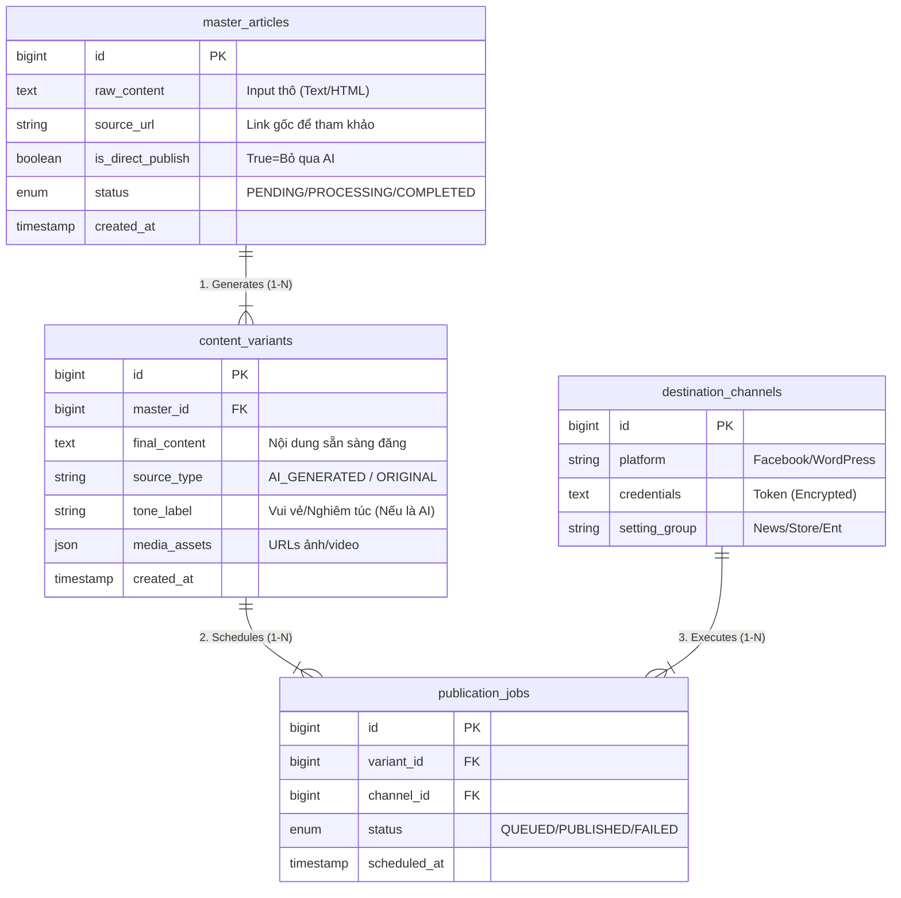

# Kế Hoạch Triển Khai Hệ Thống Tự Động Hóa Content Quy Mô Lớn (1000+ Pages)

## 1. Tổng Quan Kiến Trúc & Công Nghệ (Technical Stack)

### A. Đề Xuất Tech Stack (Full-Stack)

*Dưới đây là bộ công nghệ tôi đề xuất dựa trên tính ổn định dài hạn và hiệu suất thực tế cho hệ thống quy mô lớn:*

#### 1. Backend: Laravel 12 + PHP 8.5
*   **Vai trò trong dự án**: Trung tâm điều phối "Nhà máy nội dung": tiếp nhận bài gốc, phân phối các job AI rewrite song song, và quản lý lịch trình đăng bài (Scheduling) chính xác cho 1000+ điểm đến.
*   **Mục đích sử dụng**: Tận dụng hệ thống **Queue & Horizon** có sẵn để xử lý hàng triệu background job (AI generation, Image processing) mà vẫn đảm bảo tính tuần tự và khả năng hồi phục (retry) khi gặp lỗi mạng.

#### 2. Runtime: Laravel Octane
*   **Vai trò trong dự án**: Gateway chịu tải cao (High-concurrency) để tiếp nhận hàng nghìn Webhook từ Facebook (báo cáo trạng thái bài đăng) cùng một thời điểm.
*   **Mục đích sử dụng**: Loại bỏ độ trễ khởi động (Bootstrapping overhead) của PHP truyền thống, đảm bảo server không bị quá tải khi xử lý hàng loạt request song song trong giờ cao điểm đăng bài.

#### 3. Database: PostgreSQL 18
*   **Vai trò trong dự án**: Lưu trữ cấu hình động của 1000+ Fanpage (Token, Lịch đăng riêng, Prompt riêng) và các biến thể nội dung AI (Unstructured Data).
*   **Mục đích sử dụng**: Sử dụng tính năng **JSONB** để đánh index và truy xuất nhanh các thiết lập đa dạng của từng Page mà không cần thay đổi cấu trúc bảng (Schema) liên tục khi nghiệp vụ thay đổi.

#### 4. Frontend: Next.js (React) hoặc Vue.js
*   **Vai trò trong dự án**: Dashboard theo dõi trực quan trạng thái của hàng nghìn bài đăng và tiến độ xử lý của AI theo thời gian thực (Real-time tracking).
*   **Mục đích sử dụng**: Xây dựng giao diện quản trị phức tạp (Kéo thả lịch, Thống kê multi-page) với trải nghiệm người dùng mượt mà, không cần reload trang khi cập nhật tiến độ Job.

#### 5. Queue System: Redis
*   **Vai trò trong dự án**: Bộ đệm điều tiết tốc độ đăng bài (Rate Limiting) trung gian.
*   **Mục đích sử dụng**: Đảm bảo tuân thủ nghiêm ngặt chính sách API Rate Limit của Facebook (ví dụ: tối đa 200 request/giờ/user) bằng cách điều phối dòng chảy của job, tránh việc gửi ồ ạt khiến App bị khóa.

### B. Quan Hệ Dữ Liệu & Sơ Đồ Database (Detailed Schema)

Để giải quyết bài toán cốt lõi: **"1 input đầu vào (Master) phải biến thành hàng trăm bài đăng unique (Variant) và phân phối chính xác tới hàng nghìn điểm đến (Destination)"**, tôi thiết kế Database gồm 4 thực thể chính.

Mỗi bảng có nhiệm vụ chuyên biệt như sau:

#### 1. Bảng `master_articles` (Kho chứa bài gốc)
*   **Mục đích**: Lưu trữ dữ liệu thô đầu vào ("Center of Truth"). Dù sau này có sửa đổi biến thể thế nào, bài gốc vẫn được giữ nguyên để đối chiếu.
*   **Chi tiết các năng nhiệm vụ từng cột**:
    *   `id` (PK): Định danh duy nhất cho bài gốc.
    *   `raw_content` (Text): Chứa toàn bộ nội dung text hoặc HTML do người dùng nhập vào. Đây là nguyên liệu chính cho AI xử lý.
    *   `source_url` (String): Lưu link bài viết gốc (nếu có). Dùng để AI tự động trích dẫn nguồn hoặc hệ thống kiểm tra trùng lặp (Duplicate Check).
    *   `is_direct_publish` (Boolean): **Cờ quyết định luồng xử lý**.
        *   `true`: Hệ thống sẽ copy `raw_content` sang bảng Variants ngay lập tức (Bỏ qua AI).
        *   `false`: Hệ thống sẽ đẩy bài vào hàng đợi AI để viết lại thành nhiều bản.
    *   `status` (Enum): Trạng thái xử lý của bài gốc (`PENDING`=Mới tạo, `PROCESSING`=Đang chạy AI, `COMPLETED`=Đã sinh xong các biến thể).

#### 2. Bảng `content_variants` (Kho biến thể nội dung)
*   **Mục đích**: Chuẩn hóa dữ liệu đầu ra. Đây là bảng mà Worker đăng bài sẽ đọc dữ liệu. Nó chứa cả bài do AI viết và bài gốc (nếu chọn Direct Publish).
*   **Chi tiết các năng nhiệm vụ từng cột**:
    *   `id` (PK): Định danh biến thể.
    *   `master_id` (FK): Khóa ngoại trỏ về `master_articles`. Giúp gom nhóm: "1 bài gốc này đã đẻ ra 10 biến thể nào?".
    *   `final_content` (Text): Nội dung cuối cùng (Clean Text/HTML) sẵn sàng để gửi lên API Facebook/WordPress. Worker sẽ lấy cột này để post.
    *   `source_type` (Enum): Đánh dấu nguồn gốc (`AI_GENERATED` hoặc `ORIGINAL`). Dùng để Analytics so sánh hiệu quả tương tác giữa bài người viết và bài AI viết.
    *   `tone_label` (String): Nhãn giọng văn (ví dụ: "funny", "professional"). Dùng để routing (định tuyến): Bài "funny" sẽ ưu tiên đăng lên các Page thuộc nhóm Giải trí.
    *   `media_assets` (JSON): Chứa mảng các đường dẫn ảnh/video đính kèm. Ví dụ: `['https://s3.../img1.jpg', '...']`. Dữ liệu này đã được module xử lý ảnh (Watermark/Resize) chuẩn hóa.
    *   `created_at` (Timestamp): Thời điểm biến thể được tạo ra.

#### 3. Bảng `destination_channels` (Danh bạ kênh phân phối)
*   **Mục đích**: Quản lý danh tính và quyền truy cập của 1000+ endpoints (Page, Website) mà không phụ thuộc vào code.
*   **Các cột quan trọng & Ý nghĩa**:
    *   `platform_type` (Enum: `fb_page`, `wordpress_site`): Định danh loại nền tảng để Backend biết phải dùng Driver nào (FacebookService hay WordPressService) để post bài.
    *   `credentials` (Encrypted Text): Chứa Access Token hoặc API Key. **Bắt buộc mã hóa** để bảo mật.
    *   `category_tag` (String): Gắn thẻ cho Page (ví dụ: 'network_A', 'network_B'). Giúp User chọn nhanh "Đăng lên tất cả Page thuộc Network A" thay vì tick chọn 500 lần.

#### 4. Bảng `publication_jobs` (Bảng trung gian điều phối)
*   **Mục đích**: Đây là "khớp lệnh" quan trọng nhất. Nó biến bài toán Scale 1000 posts thành 1000 dòng record trạng thái rõ ràng.
*   **Tại sao cần bảng này?**:
    *   Không thể loop `foreach` 1000 Page rồi gọi API ngay lập tức (sẽ timeout).
    *   Chúng ta tạo ra 1000 dòng trong bảng này với trạng thái `QUEUED`. Worker sẽ lấy từng dòng ra xử lý dần.
*   **Các cột quan trọng & Ý nghĩa**:
    *   `variant_id` & `channel_id` (FK): Xác định chính xác "Biến thể nội dung nào" sẽ đăng lên "Kênh nào".
    *   `status` (`queued`, `publishing`, `published`, `failed`): Quản lý vòng đời của từng post riêng lẻ. Nếu post lên Page A lỗi -> Chỉ dòng này `failed`, các Page B, C vẫn chạy bình thường.
    *   `platform_response_id`: Lưu ID bài viết trả về từ Facebook/Web (để sau này bot vào comment hoặc lấy thống kê view/like).
    *   `scheduled_at`: Thời gian dự kiến đăng (cho phép dời lịch từng post riêng lẻ dù chung chiến dịch).

---

## 2. Chiến Lược Phân Phối & API (Distribution Strategy)

### A. Tích hợp Hệ Sinh Thái Meta (Facebook)
Quản lý 1000+ Pages đòi hỏi quản lý Token cực kỳ chặt chẽ.

*   **Quản Lý Token**:
    *   Lưu Token trong DB (Đã mã hóa).
    *   Có Job chạy ngầm định kỳ (hàng tuần) kiểm tra Token còn sống không (gọi API debug_token). Nếu chết -> Bắn thông báo (Telegram/Slack) cho Admin ngay.
*   **Chiến Thuật Post Bài (Rate Limiting)**:
    *   Không được post 400 bài cùng 1 giây (Facebook sẽ khóa App).
    *   Sử dụng **Redis Rate Logic**: Giới hạn mỗi App chỉ được gọi API 200 req/giờ (hoặc theo quota của Facebook).
    *   Chia Batch: Mỗi phút chỉ nhả ra khoảng 20-50 bài post rải đều các Page khác nhau.
*   **Quy Trình Xử Lý Đa Phương Tiện (Media Handling)**:
    *   Hệ thống phân luồng dữ liệu thông minh: Các bài đăng chứa Ảnh/Video sẽ được đẩy qua hàng đợi ưu tiên (Priority Queue) để upload asset lấy `media_id` trước, đảm bảo khi gọi API `feed`, mọi tài nguyên đã sẵn sàng. Tránh lỗi upload timeout phổ biến khi file quá nặng.
*   **Giám Sát Trạng Thái Real-time (Webhook Monitoring)**:
    *   Thay vì treo connection chờ API phản hồi (gây nghẽn server), hệ thống sẽ hoạt động theo cơ chế "Fire-and-Forget" và lắng nghe **Meta Webhooks**. Khi Facebook xử lý xong video hoặc đăng bài thành công, họ sẽ bắn tín hiệu về endpoint của ta, giúp cập nhật trạng thái `Published` trên Dashboard tức thì.

### B. Đăng Bài Đa Nền Tảng (Multi-Domain)
*   **Kiến trúc Driver/Adapter (Design Pattern)**:
    *   Sử dụng **Adapter Pattern** để mở rộng không giới hạn các loại web đích. Hệ thống lõi gọi `CodeInterface->publish()`, còn các class con (`WordPressAdapter`, `CustomWebAdapter`) sẽ tự lo phần logic riêng.
    *   **WordPress**: Tận dụng REST API kết hợp "Application Passwords". Adapter tự động map các field (Title, Content, Author, Category) vào endpoint tương ứng.
    *   **Custom Web**: Gửi Webhook chứa payload JSON chuẩn hóa.
*   **Chiến lược Đảm bảo Hiển thị (Formatting Consistency)**:
    *   **Content Transformer**: Thay vì lưu HTML cứng, lưu nội dung dưới dạng **Markdown** hoặc **JSON Blocks**. Khi publish, Adapter sẽ convert sang định dạng đích (VD: WP nhận HTML Blocks, Web React nhận JSON raw).
    *   **Asset Management (CDN)**: Để ảnh hiển thị đúng trên mọi domain, toàn bộ ảnh trong bài viết được host tại **Central S3/CDN**. Trong nội dung bài gửi đi chỉ chứa Absolute URL (Ví dụ: `https://cdn.mysystem.com/img1.jpg`), tránh việc ảnh bị lỗi 404 do relative path.

### C. AI Content Factory (Quy trình sản xuất)
Luồng dữ liệu sẽ đi như một dây chuyền nhà máy:

1.  **Input**: Người dùng ném 1 link bài báo hoặc 1 chủ đề.
2.  **Phase 1 - AI Rewrite Dispatcher (Ensuring Uniqueness)**:
    *   **Logic**: Hệ thống kích hoạt 5-10 Workers xử lý song song. Mỗi worker áp dụng một "Persona" khác nhau (KOL, Chuyên gia, GenZ).
    *   **Kỹ thuật tránh Duplicate Content**: Sử dụng tham số `temperature: 0.8` và yêu cầu AI thay đổi cấu trúc câu (Active/Passive voice), bộ từ đồng nghĩa (Synonyms) để đảm bảo độ độc nhất ngôn ngữ (Linguistic Uniqueness) > 90%.
3.  **Phase 2 - Image Enhancement**:
    *   **Upscale/Generate**: Sau khi có Text, Worker phân tích từ khóa để gọi DALL-E 3 vẽ ảnh bìa mới HOẶC dùng AI Upscaler (Real-ESRGAN) để làm nét ảnh cũ.
    *   **Watermark**: Tự động đóng dấu logo của từng Page lên ảnh để "chiếm hữu" bản quyền.
4.  **Phase 3 - Staging & Approval**:
    *   Mọi bài viết sinh ra sẽ ở trạng thái `WAITING_REVIEW`.
    *   Giao diện Dashboard cho phép User xem trước (Preview) trên giả lập giao diện Facebook/Web. User có thể sửa nhanh tại chỗ trước khi bấm "Release to Queue".

---

## 3. Vận Hành Ổn Định & Mở Rộng (Reliability)

### A. Xử lý Hàng Đợi (Queue & Failures)
Hệ thống sử dụng mô hình **Distributed Queue (Redis)** để chịu tải hàng triệu tasks.

*   **Chiến lược Retry Thông Minh (Exponential Backoff)**:
    *   *Câu hỏi*: Nếu Facebook sập (Lỗi 500/503) khi đang post 1000 bài thì sao?
    *   *Giải pháp*: Không retry ngay lập tức (tránh spam API). Hệ thống sẽ đợi theo cấp số nhân: 1 phút, 5 phút, 15 phút, 1 giờ. Nếu vẫn lỗi -> Đẩy vào **Dead Letter Queue (DLQ)** để Admin kiểm tra sau.
*   **Cơ chế Ngắt Mạch (Circuit Breaker)**:
    *   Nếu phát hiện tỷ lệ lỗi > 30% liên tiếp cho một Page/API cụ thể, hệ thống tự động "ngắt cầu dao" (Pause Queue) cho kênh đó trong 30 phút. Việc này ngăn chặn việc lãng phí tài nguyên và bảo vệ tài khoản khỏi bị Facebook đánh dấu spam do lỗi liên tục.
*   **Monitoring (Laravel Horizon)**:
    *   Dashboard theo dõi thời gian thực: Tốc độ xử lý (Throughput), Job thất bại. Tự động Auto-scale số lượng Workers đưa vào lượng job tồn đọng (Queue backlog).

### B. Giám Sát Dành Cho Người Dùng (Non-Technical Monitoring)
*   **Giao diện Trực quan (Traffic Light System)**:
    *   Sử dụng mã màu đơn giản trên Dashboard: Màu xanh (Ổn định), Màu vàng (Token sắp hết hạn), Màu đỏ (Mất kết nối/Lỗi).
    *   **Widget "Cần xử lý ngay"**: Hiển thị to, rõ danh sách các Page bị ngắt kết nối với nút bấm **"Reconnect Facebook"** để user bấm vào sửa ngay mà không cần gọi IT.
*   **Trung tâm Thông báo (Notification Center)**:
    *   Biểu tượng chuông báo trên góc màn hình: "Bài viết #123 thất bại trên 5 Page. Lý do: Ảnh quá khổ".
    *   **Email Report**: Gửi báo cáo tổng hợp vào 8:00 sáng mỗi ngày cho Quản lý ("Hôm qua: 980 bài thành công, 20 bài lỗi").
*   **Kênh Kỹ thuật (Backend Logs)**:
    *   Tích hợp Telegram/Slack Bot để báo lỗi hệ thống 500/Timeout cho đội Dev.

### C. Bảo Mật (Security - The Vault)
*   **Mã Hóa Đa Lớp (Encryption at Rest)**:
    *   Sử dụng Laravel Encrypter (AES-256-CBC) để mã hóa toàn bộ Token trong Database.
    *   **Key Rotation**: Khóa giải mã `APP_KEY` không lưu cứng trong code, mà được inject qua biến môi trường (Environment Variable) an toàn trên Server.
*   **Phân Quyền (RBAC)**:
    *   Chỉ user có quyền `SUPER_ADMIN` mới được phép xem danh sách Token hoặc kết nối Page mới.
    *   Nhân viên viết bài (Editor) chỉ thấy tên Page, hoàn toàn không tiếp cận được Token gốc.
*   **Audit Logging**:
    *   Ghi lại mọi lịch sử truy cập nhạy cảm: "Ai vừa export danh sách token?", "Ai vừa xóa Page X?". Giúp truy vết sai phạm (Accountability).

---

## 4. Tổng Kết & Bàn Giao (Deliverables)

### A. Mô Tả Luồng Đi Dữ Liệu (Visual Workflow)
*Hành trình của một bài viết từ khi là Ý tưởng đến khi Xuất bản:*
1.  **Draft**: User nhập link bài báo gốc (Dân Trí/VNExpress) vào Dashboard.
2.  **Factory Processing**:
    *   --> AI Worker 1: Viết lại thành bài "Hài hước".
    *   --> AI Worker 2: Viết lại thành bài "Nghiêm túc".
    *   --> Image Worker: Sinh ảnh bìa mới + Đóng dấu Logo.
3.  **Staging**: 2 biến thể bài viết nằm ở trạng thái `WAITING`. User duyệt nhanh.
4.  **Distribution Queue**:
    *   --> Job 1: Đẩy sang Fanpage A (Lúc 8:00).
    *   --> Job 2: Đẩy sang Website B (Lúc 8:05).
5.  **Published**: Hệ thống nhận Webhook báo "Thành công" -> Đổi màu xanh trên Dashboard.

### B. Danh Sách Công Cụ & Dịch Vụ (Tooling & Services)
*   **Infrastructure**: AWS EC2 (Server), AWS RDS (Database), AWS S3 (Lưu ảnh), Redis (Queue).
*   **AI Services**: OpenAI GPT-4o (Viết bài), Midjourney/DALL-E 3 (Vẽ ảnh).
*   **Libraries (Laravel)**:
    *   `laravel/horizon`: Quản lý Queue UI.
    *   `spatie/laravel-permission`: Quản lý phân quyền (RBAC).
    *   `facebook/graph-sdk`: Driver kết nối Meta API.

### C. Lộ Trình Triển Khai (3 Phases Roadmap)
*   **Phase 1: MVP (Core System)**: Chạy được luồng đơn giản (Nguyên liệu -> AI -> Post thủ công lên 1 Page). Mục tiêu: Chứng minh kỹ thuật (Proof of Concept).
*   **Phase 2: Automation (Content Factory)**: Tự động sinh hàng loạt và lập lịch. Xây dựng cơ chế Queue & Retry. Mục tiêu: Giảm tải con người.
*   **Phase 3: Scaling (Enterprise)**: Monitoring, Circuit Breaker, Analytics tập trung 1000 Pages. Mục tiêu: Ổn định và Báo cáo.
