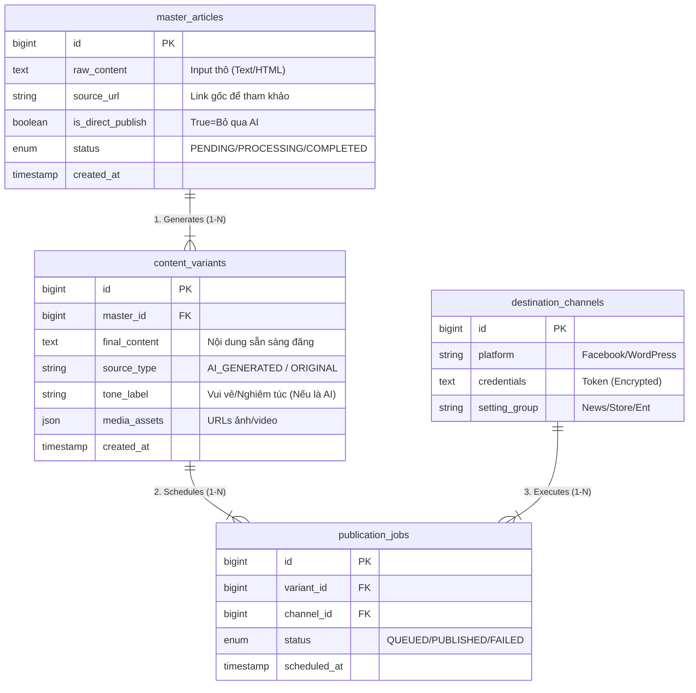

# Kế Hoạch Triển Khai Hệ Thống Tự Động Hóa Content Quy Mô Lớn (1000+ Pages)

## 1. Tổng Quan Kiến Trúc & Công Nghệ (Technical Stack)

### A. Đề Xuất Tech Stack (Full-Stack)

*Dưới đây là bộ công nghệ tôi đề xuất dựa trên tính ổn định dài hạn và hiệu suất thực tế cho hệ thống quy mô lớn:*

#### 1. Backend: Laravel 12 + PHP 8.5
*   **Vai trò trong dự án**: Trung tâm điều phối "Nhà máy nội dung": tiếp nhận bài gốc, phân phối các job AI rewrite song song, và quản lý lịch trình đăng bài (Scheduling) chính xác cho 1000+ điểm đến.
*   **Mục đích sử dụng**: Tận dụng hệ thống **Queue & Horizon** có sẵn để xử lý hàng triệu background job (AI generation, Image processing) mà vẫn đảm bảo tính tuần tự và khả năng hồi phục (retry) khi gặp lỗi mạng.

#### 2. Runtime: Laravel Octane
*   **Vai trò trong dự án**: Gateway chịu tải cao (High-concurrency) để tiếp nhận hàng nghìn Webhook từ Facebook (báo cáo trạng thái bài đăng) cùng một thời điểm.
*   **Mục đích sử dụng**: Loại bỏ độ trễ khởi động (Bootstrapping overhead) của PHP truyền thống, đảm bảo server không bị quá tải khi xử lý hàng loạt request song song trong giờ cao điểm đăng bài.

#### 3. Database: PostgreSQL 18
*   **Vai trò trong dự án**: Lưu trữ cấu hình động của 1000+ Fanpage (Token, Lịch đăng riêng, Prompt riêng) và các biến thể nội dung AI (Unstructured Data).
*   **Mục đích sử dụng**: Sử dụng tính năng **JSONB** để đánh index và truy xuất nhanh các thiết lập đa dạng của từng Page mà không cần thay đổi cấu trúc bảng (Schema) liên tục khi nghiệp vụ thay đổi.

#### 4. Frontend: Next.js (React) hoặc Vue.js
*   **Vai trò trong dự án**: Dashboard theo dõi trực quan trạng thái của hàng nghìn bài đăng và tiến độ xử lý của AI theo thời gian thực (Real-time tracking).
*   **Mục đích sử dụng**: Xây dựng giao diện quản trị phức tạp (Kéo thả lịch, Thống kê multi-page) với trải nghiệm người dùng mượt mà, không cần reload trang khi cập nhật tiến độ Job.

#### 5. Queue System: Redis
*   **Vai trò trong dự án**: Bộ đệm điều tiết tốc độ đăng bài (Rate Limiting) trung gian.
*   **Mục đích sử dụng**: Đảm bảo tuân thủ nghiêm ngặt chính sách API Rate Limit của Facebook (ví dụ: tối đa 200 request/giờ/user) bằng cách điều phối dòng chảy của job, tránh việc gửi ồ ạt khiến App bị khóa.

### B. Quan Hệ Dữ Liệu & Sơ Đồ Database (Detailed Schema)

Để giải quyết bài toán cốt lõi: **"1 input đầu vào (Master) phải biến thành hàng trăm bài đăng unique (Variant) và phân phối chính xác tới hàng nghìn điểm đến (Destination)"**, tôi thiết kế Database gồm 4 thực thể chính.

Mỗi bảng có nhiệm vụ chuyên biệt như sau:

#### 1. Bảng `master_articles` (Kho chứa bài gốc)
*   **Mục đích**: Lưu trữ dữ liệu thô đầu vào ("Center of Truth"). Dù sau này có sửa đổi biến thể thế nào, bài gốc vẫn được giữ nguyên để đối chiếu.
*   **Chi tiết các năng nhiệm vụ từng cột**:
    *   `id` (PK): Định danh duy nhất cho bài gốc.
    *   `raw_content` (Text): Chứa toàn bộ nội dung text hoặc HTML do người dùng nhập vào. Đây là nguyên liệu chính cho AI xử lý.
    *   `source_url` (String): Lưu link bài viết gốc (nếu có). Dùng để AI tự động trích dẫn nguồn hoặc hệ thống kiểm tra trùng lặp (Duplicate Check).
    *   `is_direct_publish` (Boolean): **Cờ quyết định luồng xử lý**.
        *   `true`: Hệ thống sẽ copy `raw_content` sang bảng Variants ngay lập tức (Bỏ qua AI).
        *   `false`: Hệ thống sẽ đẩy bài vào hàng đợi AI để viết lại thành nhiều bản.
    *   `status` (Enum): Trạng thái xử lý của bài gốc (`PENDING`=Mới tạo, `PROCESSING`=Đang chạy AI, `COMPLETED`=Đã sinh xong các biến thể).

#### 2. Bảng `content_variants` (Kho biến thể nội dung)
*   **Mục đích**: Chuẩn hóa dữ liệu đầu ra. Đây là bảng mà Worker đăng bài sẽ đọc dữ liệu. Nó chứa cả bài do AI viết và bài gốc (nếu chọn Direct Publish).
*   **Chi tiết các năng nhiệm vụ từng cột**:
    *   `id` (PK): Định danh biến thể.
    *   `master_id` (FK): Khóa ngoại trỏ về `master_articles`. Giúp gom nhóm: "1 bài gốc này đã đẻ ra 10 biến thể nào?".
    *   `final_content` (Text): Nội dung cuối cùng (Clean Text/HTML) sẵn sàng để gửi lên API Facebook/WordPress. Worker sẽ lấy cột này để post.
    *   `source_type` (Enum): Đánh dấu nguồn gốc (`AI_GENERATED` hoặc `ORIGINAL`). Dùng để Analytics so sánh hiệu quả tương tác giữa bài người viết và bài AI viết.
    *   `tone_label` (String): Nhãn giọng văn (ví dụ: "funny", "professional"). Dùng để routing (định tuyến): Bài "funny" sẽ ưu tiên đăng lên các Page thuộc nhóm Giải trí.
    *   `media_assets` (JSON): Chứa mảng các đường dẫn ảnh/video đính kèm. Ví dụ: `['https://s3.../img1.jpg', '...']`. Dữ liệu này đã được module xử lý ảnh (Watermark/Resize) chuẩn hóa.
    *   `created_at` (Timestamp): Thời điểm biến thể được tạo ra.

#### 3. Bảng `destination_channels` (Danh bạ kênh phân phối)
*   **Mục đích**: Quản lý danh tính và quyền truy cập của 1000+ endpoints (Page, Website) mà không phụ thuộc vào code.
*   **Các cột quan trọng & Ý nghĩa**:
    *   `platform_type` (Enum: `fb_page`, `wordpress_site`): Định danh loại nền tảng để Backend biết phải dùng Driver nào (FacebookService hay WordPressService) để post bài.
    *   `credentials` (Encrypted Text): Chứa Access Token hoặc API Key. **Bắt buộc mã hóa** để bảo mật.
    *   `category_tag` (String): Gắn thẻ cho Page (ví dụ: 'network_A', 'network_B'). Giúp User chọn nhanh "Đăng lên tất cả Page thuộc Network A" thay vì tick chọn 500 lần.

#### 4. Bảng `publication_jobs` (Bảng trung gian điều phối)
*   **Mục đích**: Đây là "khớp lệnh" quan trọng nhất. Nó biến bài toán Scale 1000 posts thành 1000 dòng record trạng thái rõ ràng.
*   **Tại sao cần bảng này?**:
    *   Không thể loop `foreach` 1000 Page rồi gọi API ngay lập tức (sẽ timeout).
    *   Chúng ta tạo ra 1000 dòng trong bảng này với trạng thái `QUEUED`. Worker sẽ lấy từng dòng ra xử lý dần.
*   **Các cột quan trọng & Ý nghĩa**:
    *   `variant_id` & `channel_id` (FK): Xác định chính xác "Biến thể nội dung nào" sẽ đăng lên "Kênh nào".
    *   `status` (`queued`, `publishing`, `published`, `failed`): Quản lý vòng đời của từng post riêng lẻ. Nếu post lên Page A lỗi -> Chỉ dòng này `failed`, các Page B, C vẫn chạy bình thường.
    *   `platform_response_id`: Lưu ID bài viết trả về từ Facebook/Web (để sau này bot vào comment hoặc lấy thống kê view/like).
    *   `scheduled_at`: Thời gian dự kiến đăng (cho phép dời lịch từng post riêng lẻ dù chung chiến dịch).

---

## 2. Chiến Lược Phân Phối & API (Distribution Strategy)

### A. Tích hợp Hệ Sinh Thái Meta (Facebook)
Quản lý 1000+ Pages đòi hỏi quản lý Token cực kỳ chặt chẽ.

*   **Quản Lý Token**:
    *   Lưu Token trong DB (Đã mã hóa).
    *   Có Job chạy ngầm định kỳ (hàng tuần) kiểm tra Token còn sống không (gọi API debug_token). Nếu chết -> Bắn thông báo (Telegram/Slack) cho Admin ngay.
*   **Chiến Thuật Post Bài (Rate Limiting)**:
    *   Không được post 400 bài cùng 1 giây (Facebook sẽ khóa App).
    *   Sử dụng **Redis Rate Logic**: Giới hạn mỗi App chỉ được gọi API 200 req/giờ (hoặc theo quota của Facebook).
    *   Chia Batch: Mỗi phút chỉ nhả ra khoảng 20-50 bài post rải đều các Page khác nhau.

### B. Đăng Bài Đa Nền Tảng (Multi-Domain)
*   **WordPress**: Dùng **WordPress REST API** + Plugin "Application Passwords" để xác thực.
*   **Custom Web**: Xây dựng API chuẩn nhận JSON (Webhooks).
*   **Format**: Trước khi đẩy bài, hệ thống sẽ convert Markdown từ AI sang HTML chuẩn tương ứng với từng nền tảng (VD: WP cần HTML block, Web custom cần raw HTML).

### C. AI Content Factory (Quy trình sản xuất)
Luồng dữ liệu sẽ đi như một dây chuyền nhà máy:

1.  **Input**: Người dùng ném 1 link bài báo hoặc 1 chủ đề.
2.  **Phase 1 - AI Rewrite Dispatcher**:
    *   Hệ thống tạo ra 5-10 Job rewrite song song (Mỗi job dùng 1 prompt khác nhau: "Hài hước", "Chuyên gia", "Tóm tắt"...).
3.  **Phase 2 - Image Generator**:
    *   Sau khi có Text -> Gọi tiếp DALL-E/Midjourney để tạo ảnh theo context bài viết.
    *   Hoặc dùng tool Upscale ảnh cũ.
4.  **Phase 3 - Staging (Human Review - Optional)**:
    *   Bài viết trạng thái "Pending Approval".
    *   Admin duyệt nhanh -> Bấm "Approve All" -> Đẩy vào hàng đợi phân phối.

---

## 3. Vận Hành Ổn Định & Mở Rộng (Reliability)

### A. Xử lý Hàng Đợi (Queue & Failures)
*   **Vấn đề**: API Facebook chết, Server lag, Mạng đứt.
*   **Giải pháp - Smart Retry**:
    *   Nếu lỗi 5xx (Facebook sập): Thử lại sau 5 phút.
    *   Nếu lỗi 4xx (Token chết): Dừng ngay, đánh dấu "Failed", báo Admin, không retry để tránh bị ban.
    *   **Laravel Horizon**: Dùng công cụ này để có giao diện theo dõi trực quan xem Job nào đang chạy, Job nào fail, tốc độ tiêu thụ queue.

### B. Giám Sát (Monitoring)
*   Tích hợp **Telegram/Slack Bot**:
    *   "⚠️ Alert: 15 Posts failed on Page [Tên Page] due to Token Expired."
    *   "✅ Success: Campaign [Tên] finished distributed to 450 pages."

### C. Bảo Mật (Security)
*   **Vault**: Token Facebook là tài sản quý nhất.
    *   Sử dụng `App Encryption` của Laravel (AES-256) để mã hóa cột Token trong DB. Cho dù hacker dump được DB cũng không lấy được token raw.
    *   IP Whitelist: API đăng bài chỉ nhận request từ IP Server của bạn.

---

## 4. Lộ Trình Triển Khai (Roadmap)

### Giai Đoạn 1: MVP (Core System) - 2 Tuần
*   Dựng Database quản lý tập trung Pages & Domains.
*   Module "Add Page" (Lưu Token vào DB).
*   Module "AI Write": Input đơn giản -> Gọi Gemini -> Ra text.
*   Module "Manual Post": Chọn 1 bài -> Chọn 5 Page -> Bấm Post -> Chạy Async Queue.

### Giai Đoạn 2: Automation & Scaling - 3 Tuần
*   Xây dựng "Content Factory": Tự động rewrite ra nhiều bản.
*   Tích hợp Image Gen API.
*   Xây dựng Lập lịch (Scheduler UI): Kéo thả lịch đăng bài.
*   Cài đặt Rate Limiting (Để không bị FB chặn khi post nhiều).

### Giai Đoạn 3: Enterprise Features - 3 Tuần
*   Dashboard Analytics: Thống kê Like/Comment tổng hợp từ 1000 Page về 1 chỗ.
*   Auto-Reply Comment (Dùng AI trả lời comment trên 1000 page).
*   Quy trình duyệt bài nhiều lớp (Nhân viên viết -> Sếp duyệt -> Máy đăng).
